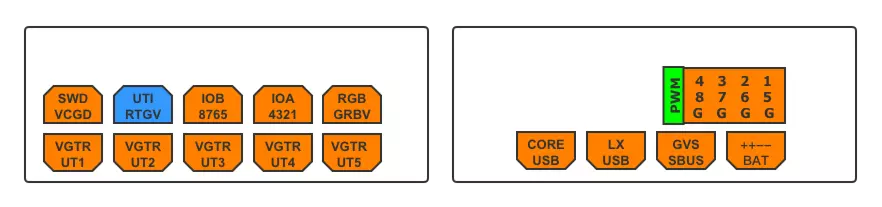

# USV Hardware 
## _Concise and Correct_

Link for Flight controller

## Controller Specification:

- MCU: STM32F407
- PINS out:
  

### 左图上5

- SWD：VCGD依次为：3.3V、CLK、GND、DIO
- UTI：凌霄IMU串口2
- IOB：拓展IO，具体见原理图
- IOA：拓展IO，具体见原理图
- RGB：GRBV依次为：绿、红、蓝、5V

### 左图下5

UT：串口，RTGV依次为：RX、TX、GND、5V

- UTI：无用
- UT1：GPS
- UT2：用户拓展
- UT3：用户拓展
- UT4：匿名光流
- UT5：数传

### 右图上

- PWM：电调接口，数字代表第几通道
### 右图下
- CORE USB：核心板USB接口
- LX USB：凌霄IMU的USB接口
- SBUS：GVS依次为：GND、5V、Signal
- BAT：电池接口，+接电池正极，-接电池负极

## GNSS Teminology

| 简写 | 全称 | 描述 |
| ------ | ------ | ------ |
| GNSS | Global Navigation Satellite System | A broad term encompassing different types of satellite-based positioning, navigation and timing (PNT) systems used globally |
| GPS | Global Positioning System | 
| INS | Inertial navigation system |
| GIS | geographic information system | a map matches locations to positions |
| AtoN | Aid to navigation | Landmark|
| 

## Definition

- **Position** - a set of quantitatively numerical coordinates (定量)
- **Location** - a person, signpost, or address will describe a location qualitatively (定性)
-  **Navigation①** -  the position and velocity of a moving body with respect to a known reference point
-  **Navigation②** - the planning and maintenance of a course from one location to another, avoiding obstacles and collisions
-  **Positioning** - 主要3类：real-time and postprocessed, fixed or movable, self-positioning and remote positioning
-  **Position fixing** - uses identifiable external information to determine position directly
-  **Dead reckoning** - measures the distance and direction traveled

## Common Sensors

## RC Protocols

- **RX Protocols** – communication between the radio receiver (RX) and flight controller (FC)
- **TX Protocols** – communication between the radio transmitter (TX) and radio receiver (RX)

