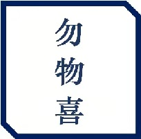
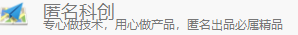

# USV Hardware 
## _Concise and Correct_

Link for Flight controller

## Controller Specification:

- MCU: STM32F407
- PINS out:
  

### 左图上5

- SWD：VCGD依次为：3.3V、CLK、GND、DIO
- UTI：凌霄IMU串口2
- IOB：拓展IO，具体见原理图
- IOA：拓展IO，具体见原理图
- RGB：GRBV依次为：绿、红、蓝、5V

### 左图下5

UT：串口，RTGV依次为：RX、TX、GND、5V

- UTI：无用
- UT1：GPS
- UT2：用户拓展
- UT3：用户拓展
- UT4：匿名光流
- UT5：数传

### 右图

- PWM：电调接口，数字代表第几通道
- CORE USB：核心板USB接口
- LX USB：凌霄IMU的USB接口
- SBUS：GVS依次为：GND、5V、Signal
- BAT：电池接口，+接电池正极，-接电池负极

